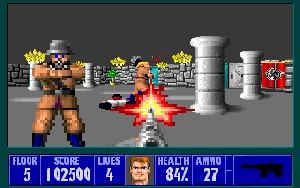
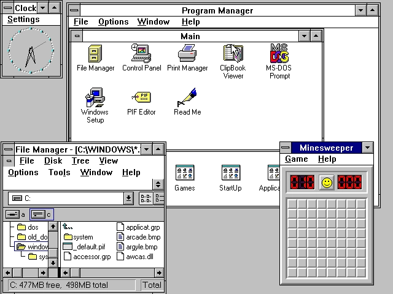
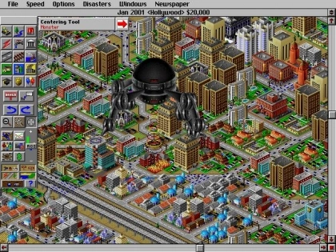
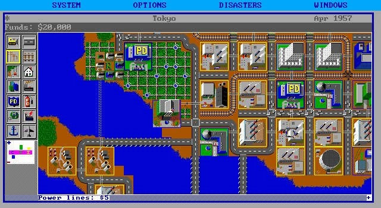
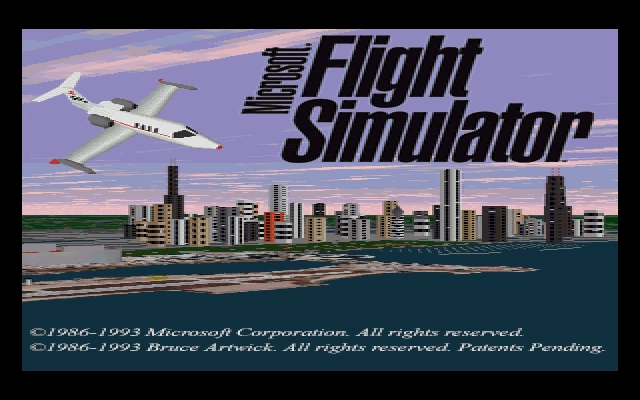
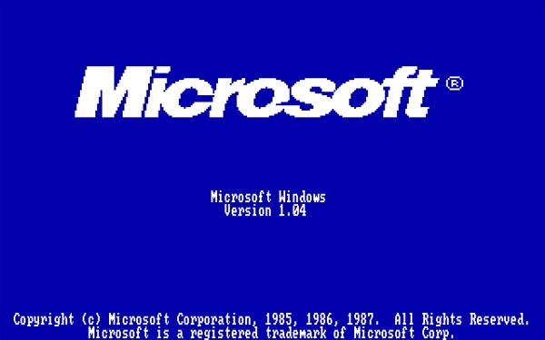

# Run DOSBox Emulator in web browser.
If we forgot your favorite game, we're sorry, you can [new issue](https://github.com/OverdueWeevil2-Org/DOSBox-Emulator/issues/new?assignees=&labels=&template=game-request.md&title=%5BGame+request%5D)
### Jump to: [Digger](#digger), [Wolfenstein 3D](#wolfenstein-3d), [Windows 3.1](#windows-31), [SimCity 2000](#simcity-2000), [SimCity Classic](#simcity-classic), [Super Mario Bros.](#super-mario-bros), [Microsoft Flight Simulator](#microsoft-flight-simulator), [Windows 1.04](#windows-104)
### Click the thumbnail to open a game.
# Digger
Digger is a video game released by Canadian developer Windmill Software as a self-booting disk for IBM PC compatibles. It is similar to the 1982 arcade game Mr. Do! Digger was developed by Rob Sleath, the primary developer of Windmill games. In 1984, Digger was converted to run on IBM PCjr and IBM JX.

# Wolfenstein 3D
Wolfenstein 3D is a first-person shooter video game developed by id Software and published by Apogee Software and FormGen. Originally released on May 5, 1992 for DOS, it was inspired by the 1981 Muse Software video game Castle Wolfenstein, and is the third installment in the Wolfenstein series. In Wolfenstein 3D, the player assumes the role of Allied spy William "B.J." Blazkowicz during World War II as he escapes from the Nazi German prison Castle Wolfenstein and carries out a series of crucial missions against the Nazis. The player traverses each of the game's levels to find an elevator to the next level or kill a final boss, fighting Nazi soldiers, dogs, and other enemies with knives and a variety of guns.

# Windows 3.1
Windows 3.1 is a series of 16-bit operating environments produced by Microsoft for use on personal computers, released on April 6, 1992. The series began with Windows 3.1, which was first sold during April 1992 as a successor to Windows 3.0. Subsequent versions were released between 1992 and 1993, notably Windows 3.11, until the series was superseded by the Windows 9x series starting in 1995 with Windows 95. During its lifespan, Windows 3.1 introduced several enhancements to the still MS-DOS-based platform, including improved system stability, expanded support for multimedia, TrueType fonts, and workgroup networking.

# SimCity 2000
SimCity 2000 is a city-building simulation video game jointly developed by Will Wright and Fred Haslam of Maxis.

# SimCity Classic
SimCity, also known as Micropolis or SimCity Classic, is a city-building simulation video game developed by Will Wright and released for a number of platforms from 1989 to 1991. SimCity features two-dimensional graphics and an overhead perspective.

# Super Mario Bros.
Super Mario Bros. is a platform game developed and published by Nintendo.

# Microsoft Flight Simulator
**WARNING: This game has no mobile support.**

Microsoft Flight Simulator (often abbreviated as MSFS or FS) is a series of amateur flight simulator programs for Microsoft Windows operating systems, and earlier for MS-DOS and Classic Mac OS.

# Windows 1.04
Windows version 1.04, released in April 1987, added support for the new IBM PS/2 computers, although no support for PS/2 mice or new VGA graphics modes was provided.

